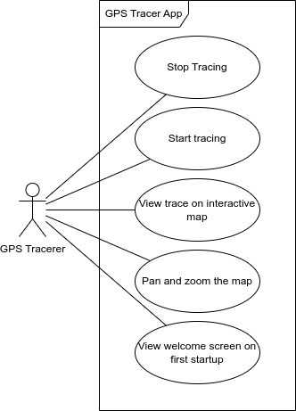
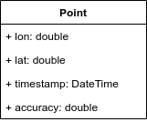

# Funktionale Anforderungen

- Der User kann das Tracing stoppen.
- Der User kann das Tracing starten.
- Der User sieht seinen Trace auf einer interaktiven Karte.
- Der User kann die Karte bewegen.
- Beim ersten Start der App erscheint ein Welcome-Screen.

# Akteure

## GPS Tracerer

Der "GPS Tracerer" ist der Endnutzer der Applikation. Er will seinen Standort tracken lassen, um später zu wissen, wo er so war.

# Nicht-funktionale Anforderungen

- Die App läuft auf Android 8.1.
- Die App nutzt OpenStreetMaps als Kartenmaterial.
- Die App ist open source.
- Die App kann in einem Android 8.1 Emulator mit gemockter Location getestet werden.
- Die App ist kostenlos.
- Die Daten werden lokal persistiert.

# Testkonzept

Die App wird entweder in einem Android 8.1 Emulator mit gemockter Location oder auf einem persönlichen physischen Gerät mit gemockter Location getestet.

Gewisse Teile können bspw. durch Unit-Tests automatisiert getestet werden. Zusätzlich zu automatisierten Tests soll die App manuell getestet werden.

## Testfälle

### Welcome Screen

#### Vorbedingungen

Die App wurde zum ersten Mal gestartet.

#### Schritte

1. Klick auf Button.
2. Permission zulassen.

#### Erwartet

Der Welcome Screen taucht auf. Mit einem Klick auf den entsprechenden Button wird nach der Location-Permission gefragt. Bei Akzeptanz jener wird zum Homescreen gewechselt.

### Karte bewegen

#### Vorbedingungen

Die Karte wurde geladen.

#### Schritte

1. Die Karte wird mit dem Finger bewegt.

#### Erwartet

Die Karte und der Trace bewegen sich entsprechend.

### Karte zoomen

#### Vorbedingungen

Die Karte wurde geladen.

#### Schritte

1. Die Karte wird mit zwei Fingern gezoomt.

#### Erwartet

Die Karte und der Trace werden entsprechend vergrössert/verkleinert.

### Tracing aktivieren

#### Vorbedingungen

Das Tracing ist deaktiviert.

#### Schritte

1. Auf den Switch tippen.

#### Erwartet

Das Tracing wird aktiviert.

### Tracing deaktivieren

#### Vorbedingungen

Das Tracing ist aktiviert.

#### Schritte

1. Auf den Switch tippen.

#### Erwartet

Das Tracing wird deaktiviert.

# Klassendiagramm

